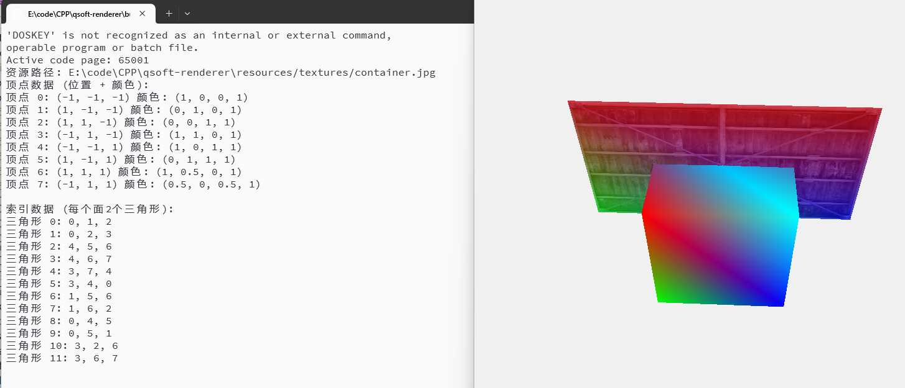

# QSoftRenderer

#### 介绍
一个模仿OpenGL的软渲染器实现，初步支持了渲染管线，纹理贴图，MSAA反走样实现，支持glsl shader语言编程

# 基础完成部分
+ 相机
+ 顶点配置
+ 顶点着色器
+ 图元装配（三角形）
+ 光栅化
+ 片段着色器
+ 纹理贴图
+ MSAA反走样
+ 面剔除（基础）
+ 颜色混合（基础）
+ 深度测试（基础）

# 正在进行
+ 模板测试

# 待完成
+ 网格模型加载
+ Blinn-Phong 光照模型
+ 法线贴图
+ 天空盒
+ 纹理Mipmap

# 暂不打算完成的部分
+ 点绘制
+ 线绘制
+ 纹理各项异性过滤

