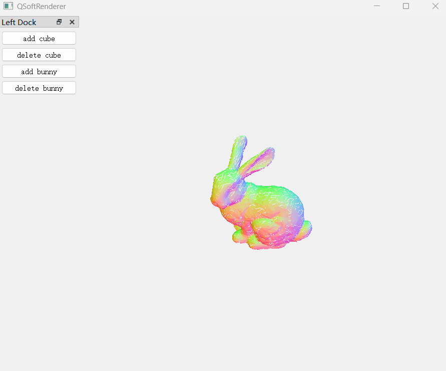

# QSoftRenderer

> **"If you want to understand the GPU, build one yourself."**

一个**完全运行在 CPU 上**的 3D 软件光栅化渲染器，从零实现了 OpenGL 渲染管线的每一个阶段——没有调用任何 GPU API，所有顶点变换、图元装配、光栅化、片元着色、纹理采样、深度测试、MSAA 反走样均由 C++ 在 CPU 端手写完成。

**A pure-CPU software rasterizer** that faithfully reproduces the entire classic OpenGL rendering pipeline — no GPU calls, just raw C++ and math.




---


## 架构一览 / Architecture

```
┌─────────────── Qt Main Thread (60fps) ───────────────┐
│  MainWindow → RenderWidget → QImage → QPainter       │
│                    ↑ front buffer (read only)         │
│  ┌───────────────── DoubleBuffer ──────────────────┐  │
│  │  FrameBuffer[0]  ←→  FrameBuffer[1]  (atomic)   │  │
│  └─────────────────────────────────────────────────┘  │
│                    ↓ back buffer (write)               │
│  ┌────────── Render Thread (30fps) ────────────────┐  │
│  │  Render → drawScene() → MSAA resolve → swap()   │  │
│  │    ├─ Command Queue (AddNode/RemoveNode/Resize)  │  │
│  │    ├─ Camera (orbit animation)                   │  │
│  │    └─ Nodes (vertices + indices + shader)        │  │
│  └─────────────────────────────────────────────────┘  │
└───────────────────────────────────────────────────────┘
```

---

## 渲染管线 / Rendering Pipeline

```
  Vertex Data          Vertex Shader       Primitive Assembly     Face Culling
      │                      │                     │                    │
      ▼                      ▼                     ▼                    ▼
┌──────────┐  ┌──────────────────────┐  ┌─────────────────┐  ┌────────────────┐
│ inter-   │  │ programmable VS      │  │ triangle strips  │  │ back-face      │
│ leaved   │→ │ * MVP transform      │→ │ * 3-index groups │→ │ culling via    │
│ vertex   │  │ * attr interpolation │  │ * clip frustum   │  │ 2D cross       │
│ array    │  │   (smooth/flat)      │  │   (stubbed)      │  │ product        │
└──────────┘  └──────────────────────┘  └─────────────────┘  └────────────────┘
                                                                     │
  Perspective Divide    Viewport Transform     Rasterization          │
      │                      │                     │                  │
      ▼                      ▼                     ▼                  ▼
┌──────────────┐  ┌────────────────────┐  ┌─────────────────────────────────────┐
│ clip-space   │  │ NDC → screen       │  │ bounding box traversal               │
│ (x,y,z,w)    │→ │ pixel coords       │→ │ * edge function coverage test        │
│ → NDC / w    │  │ [0, w-1]×[h-1, 0] │  │ * 4x MSAA rotated-grid sub-sampling   │
└──────────────┘  └────────────────────┘  │ * perspective-correct interpolation   │
                                          │ * per-sample depth test               │
                                          └───────────────────────────────────────┘
                                                           │
      Fragment Shader      Color Blend      MSAA Resolve    │
           │                   │                │           │
           ▼                   ▼                ▼           ▼
 ┌──────────────────┐  ┌──────────────┐  ┌──────────────┐  ┌──────────────┐
 │ programmable FS   │  │ alpha blend  │  │ avg 4 samples │  │ Qt display   │
 │ * texture sample  │→ │ src·α +      │→ │ → final pixel │→ │ via QImage   │
 │ * bilinear filter │  │ dst·(1-α)    │  │ color         │  │ QPainter     │
 │ * light/color calc│  │ ...          │  │               │  │              │
 └──────────────────┘  └──────────────┘  └──────────────┘  └──────────────┘
```

---

## 核心特性 / Core Features

| 模块 | 实现内容 |
|---|---|
| **Shader 系统** | 可编程顶点/片元着色器，支持 `uniform`（`std::any` 类型擦除）、纹理绑定、顶点属性输入/输出布局，`Smooth`/`Flat` 两种插值模式 |
| **MSAA 4x** | 4 个旋转网格亚像素采样点，逐采样深度测试，像素中心单次着色 + 覆盖复制，最后 resolve 求平均 |
| **透视校正插值** | 基于 `1/w` 的重心坐标插值，正确处理透视投影下的纹理/颜色渐变 |
| **纹理系统** | stb_image 加载，支持 Nearest / Bilinear 采样，Repeat / MirroredRepeat / ClampToEdge 三种 Wrap 模式 |
| **颜色混合** | 完整实现了 OpenGL 的 10 种混合因子，提供 `alphaBlend` / `additiveBlend` / `multiplyBlend` / `customBlend` 便捷接口 |
| **深度测试** | 逐采样深度比较与写入，深度范围 `[0, 1]`，可配置的深度写入开关 |
| **面剔除** | 通过 2D 叉积判断三角形正反面，支持单独开启背面/正面剔除 |
| **双缓冲** | 基于 `std::atomic` + acquire/release 内存序的**无锁**双缓冲，渲染线程与 UI 线程零竞争 |
| **命令队列** | `RenderCommand` + `std::queue` + `std::mutex`，支持运行时动态添加/删除渲染节点 |
| **动态相机** | 支持运行时设置相机回调，Demo 中实现了环绕相机的周期运动 |

---

## 项目结构 / Project Structure

```
qsoft-renderer/
├── src/                        # 渲染核心库 (static lib)
│   ├── Render.h / Render.cpp   # 核心渲染器 — 完整管线实现 (467 行)
│   ├── Shader.h                # 着色器基类 — VS/FS 接口 + uniform + 属性布局
│   ├── SquareCubeShader.h      # 示例着色器：带纹理的正方形 / 纯色立方体
│   ├── Camera.h / Camera.cpp   # 相机 — View + Projection 矩阵 + 回调动画
│   ├── Texture.h / Texture.cpp # 纹理 — 加载 + 采样 + Wrap 模式
│   ├── ColorBlend.h            # 颜色混合 — 10 种 OpenGL 混合因子
│   ├── RenderHelper.h          # 光栅化数学 — 重心坐标 + 包围盒 + 边缘函数
│   ├── TriangleData.h          # 三角形数据 — clip/NDC/screen 三组坐标
│   ├── DoubleBuffer.h          # 无锁双缓冲 — atomic acquire/release
│   ├── Node.h / Node.cpp       # 渲染节点 — 顶点 + 索引 + 布局 + 着色器
│   ├── RenderThread.h/.cpp     # 专用渲染线程 — 30fps 循环
│   └── RenderWidget.h/.cpp     # Qt 显示控件 — 60fps 轮询
├── test/                       # 应用入口 + Demo 窗口
│   ├── main.cpp                # Qt 入口
│   └── MainWindow.h/.cpp       # 主窗口 — 添加/删除立方体，环绕相机
├── resources/
│   ├── textures/               # 纹理资源 (container.jpg, wood, brick...)
│   ├── objects/                # 3D 模型 (vampire, nanosuit, backpack...)
│   └── fonts/                  # TrueType 字体
├── include/
│   ├── glm/                    # OpenGL Mathematics (向量/矩阵数学)
│   └── stb_image.h             # 单头文件图片加载器
├── image/
│   └── run_result.png          # 运行截图
│   └── run_bunny_obj.png       # 运行截图：加载 bunny.obj 模型
├── CMakeLists.txt              # CMake 构建配置
└── CMakePresets.json           # 预设：Windows/Linux × Debug/Release
```

---

## 构建与运行 / Build & Run

### 依赖 / Dependencies

| 依赖 | 说明 |
|---|---|
| **Qt 5.15+** (Core, Gui, Widgets) | 窗口创建 + 帧缓冲显示 |
| **GLM** (bundled) | 向量/矩阵数学 (`glm::mat4`, `glm::vec3`, `lookAt`, `perspective`) |
| **stb_image** (bundled) | 图片加载 (PNG, JPG) |
| **CMake 3.20+** | 构建系统 |
| **MSVC 2019+** / **GCC 11+** / **Clang 14+** | C++20 编译器 |

### 构建步骤 / Build Steps

```bash
# 设置纹理资源路径
export RENDER_RESOURCE_PATH=/path/to/qsoft-renderer/resources

# CMake 配置 (以 Windows + MSVC 为例)
cmake --preset x64-release

# 构建
cmake --build build/x64-release --config Release

# 运行
./build/x64-release/bin/QSoftRenderer.exe
```

---

## 已完成 / Completed

- [x] Camera (View + Projection 矩阵)
- [x] 可编程顶点/片元着色器
- [x] 顶点属性布局配置 (interleaved vertex array)
- [x] 图元装配 (三角形)
- [x] 面剔除 (背面/正面)
- [x] 视口变换 (NDC → Screen)
- [x] 光栅化 (边缘函数 + 包围盒遍历)
- [x] MSAA 4x 反走样 (旋转网格亚采样 + Resolve)
- [x] 透视校正插值 (perspective-correct barycentric)
- [x] 深度测试 (逐采样 Z-Buffer)
- [x] 纹理映射 (Nearest + Bilinear 采样, 三种 Wrap 模式)
- [x] 颜色混合 (10 种 OpenGL 混合因子)
- [x] 无锁双缓冲渲染

## 进行中 / In Progress

- [ ] Stencil 模板测试

## 计划中 / Planned

- [ ] Blinn-Phong 光照模型
- [ ] 法线贴图 (Normal Mapping)
- [ ] 天空盒 (Skybox)
- [ ] 纹理 Mipmap
- [ ] 3D 模型加载 (OBJ / glTF)

## 不计划实现 / Not Planned

- [ ] 点和线的绘制
- [ ] 各向异性纹理过滤

---

## License

MIT © zhanghd (2025)
